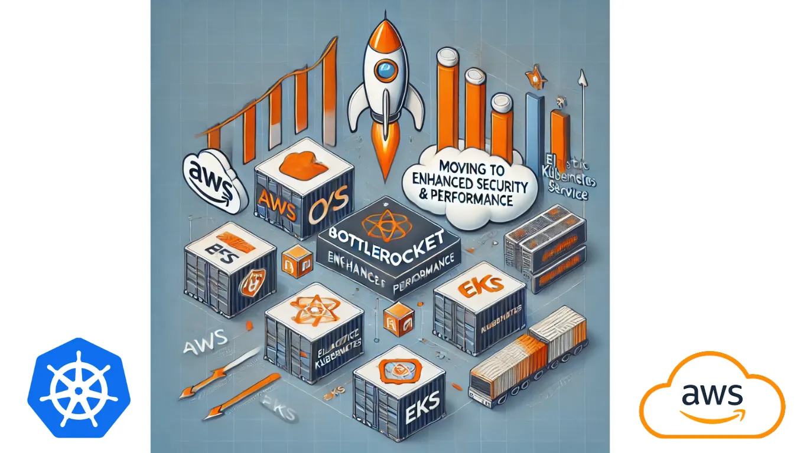

## Moving to Bottlerocket OS for Enhanced Security & Performance



[This tutorial on my blog](https://igorzhivilo.com/2025/02/06/bottlerocket-os/)

In this tutorial, I will walk you through migrating your Amazon EKS worker nodes to Bottlerocket OS, troubleshooting Bottlerocket OS, and sharing the challenges I encountered during the process.

### What is Bottlerocket OS?
Bottlerocket is an open-source, Linux-based operating system developed by AWS, optimized for running container workloads. Unlike traditional general-purpose operating systems, Bottlerocket is specifically designed for security, minimalism, and automated updates in containerized environments.

### Why Use Bottlerocket OS?
Bottlerocket OS offers several benefits over traditional Linux distributions for Kubernetes clusters:

✔ Optimized for Containers — Unlike general-purpose OSes like Ubuntu or Amazon Linux, Bottlerocket is purpose-built for running containers, reducing overhead and improving efficiency.

✔ Automated and Atomic Updates — Instead of package-by-package updates, Bottlerocket applies updates atomically (all at once), minimizing failures and reducing the need for manual patching.

✔ Enhanced Security — Features such as a read-only root filesystem, SELinux enforcement, and minimal attack surface help improve security posture.

✔ Faster Boot Times & Performance — A lightweight, minimal OS means faster startup times and lower resource usage.

✔ Native AWS Integration — Seamlessly integrates with AWS services like EKS, ECS, and Karpenter, making it easy to deploy and manage at scale.

By migrating your EKS worker nodes to Bottlerocket OS, you can improve security, reliability, and performance in your Kubernetes environment.

### Prerequisites
Before proceeding with the tutorial, ensure you have the following:

✅ An existing EKS cluster

Additionally, it’s important to note that our EKS cluster’s worker nodes are managed by Karpenter.

### Karpenter
What is Karpenter?

>  Karpenter is an open-source Kubernetes node provisioning tool that dynamically adds and removes worker nodes in real time based on the cluster’s workload demands. Unlike traditional auto-scalers (such as Cluster Autoscaler), Karpenter directly interacts with the cloud provider’s APIs to launch nodes without relying on Auto Scaling Groups.

Karpenter dynamically manages the majority of the cluster’s worker nodes, both on-demand and spot instances.

To enable Bottlerocket OS for these nodes, you will need to modify the Karpenter NodePool configuration.

## Let’s upgrade to Bottlerocket OS!
### Upgrading the Karpenter NodePool
Here’s what my EC2NodeClass looked like before the upgrade:”

‘EC2NodeClass’ used for general purpose workloads

* Notice the ‘amiFamily: AL2’ setting — this means that EC2 instances will be provisioned with the ‘Amazon Linux 2 AMI’
* One EBS volume with size of 80Gi attached

```yaml
apiVersion: karpenter.k8s.aws/v1beta1
kind: EC2NodeClass
metadata:
  name: general
spec:
  amiFamily: AL2  # Amazon Linux 2 AMI
  role: "KarpenterNodeRole"  # IAM role for instances
  securityGroupSelectorTerms:
    - tags:
        karpenter: "enabled"
  subnetSelectorTerms:
    - tags:
        karpenter: "enabled"
  instanceProfile: "KarpenterInstanceProfile"
  tags:
    Name: "karpenter-worker"
    Environment: "dev"
  blockDeviceMappings:
    - deviceName: "/dev/xvda"
      ebs:
        volumeSize: 80Gi
        volumeType: gp3
        encrypted: true
```

To use Bottlerocket OS, we need to specify the Bottlerocket OS AMI:

```yaml
amiFamily: Bottlerocket
  blockDeviceMappings:
  - deviceName: /dev/xvda
    ebs:
      deleteOnTermination: true
      iops: 3000
      throughput: 125
      encrypted: true
      volumeSize: 20Gi
      volumeType: gp3
  - deviceName: /dev/xvdb
    ebs:
      deleteOnTermination: true
      iops: 3000
      throughput: 125
      encrypted: true
      volumeSize: 80Gi
      volumeType: gp3
```

**Pay close attention** to the difference: With the AL2 AMI, we defined a single volume, whereas with Bottlerocket, we define two volumes: ‘/dev/xvda’ and ‘/dev/xvdb’.

• **‘/dev/xvda’** (OS Volume) — This volume is used to store the operating system itself. It contains the active and passive partitions, the bootloader, dm-verity data, and the data store for the Bottlerocket API.

• **‘/dev/xvdb’** (Data Volume) — This volume is used for everything running on top of Bottlerocket, including container images, storage for running containers, and persistent storage/volumes.

> If you do not define the ‘/dev/xvdb’ data volume, it will default to a 20GB size (at least in my case it happened), which may cause different problems like k8s pod eviction due to insufficient disk storage. Additionally, the OS volume ‘/dev/xvda’ will have an unnecessarily large size, which is not ideal either.

To avoid these issues, be mindful of your volume definitions when provisioning Bottlerocket OS instances!

### Here is the final YAML configuration for the NodePool:

```yaml
apiVersion: karpenter.k8s.aws/v1beta1
kind: EC2NodeClass
metadata:
  name: general
spec:
  amiFamily: Bottlerocket 
  role: "KarpenterNodeRole"
  securityGroupSelectorTerms:
    - tags:
        karpenter: "enabled"
  subnetSelectorTerms:
    - tags:
        karpenter: "enabled"
  instanceProfile: "KarpenterInstanceProfile"
  tags:
    Name: "karpenter-worker"
    Environment: "dev"
  blockDeviceMappings:
  - deviceName: /dev/xvda
    ebs:
      deleteOnTermination: true
      iops: 3000
      throughput: 125
      encrypted: true
      volumeSize: 20Gi
      volumeType: gp3
  - deviceName: /dev/xvdb
    ebs:
      deleteOnTermination: true
      iops: 3000
      throughput: 125
      encrypted: true
      volumeSize: 80Gi
      volumeType: gp3
  userData:  |
   [settings.host-containers.admin]
   enabled = true
```
I enabled admin container on all worker nodes for advanced Bottlerocket OS troubleshooting ( look at ‘userData’ )

### Worker Nodes with Bottlerocket OS Don’t Have SSH Access — What to Do?
Unlike Amazon Linux 2 (AL2), Bottlerocket OS does not support direct SSH access by default. Bottlerocket is designed to be an immutable, minimal, and secure OS optimized for container workloads, which means SSH is disabled to reduce attack surfaces.

However, if you need SSH access to your Bottlerocket worker nodes, follow these methods:

### Option 1: Use Admin container
Bottlerocket has an [administrative container](https://github.com/bottlerocket-os/bottlerocket-admin-container), disabled by default, that runs outside of the orchestrator in a separate instance of containerd. This container has an SSH server that lets you log in as ec2-user using your EC2-registered SSH key. Outside of AWS, you can pass in your own SSH keys. (You can easily replace this admin container with your own just by changing the URI; see Settings.

To enable the container, you can change the setting in user data when starting Bottlerocket, for example EC2 instance user data:

```yaml
[settings.host-containers.admin]
enabled = true
```

### How do I use kubectl debug node with Bottlerocket?

The [debug node option](https://kubernetes.io/docs/tasks/debug/debug-cluster/kubectl-node-debug/) from kubectl can be used to gain access to a Bottlerocket node as follows:

```yaml
kubectl debug node/<node name> -it --image=ubuntu --profile=sysadmin
```

### Enable admin container
Once the debug pod is started and you have a shell, you can run chroot /host apiclient exec admin bash to access the admin container (if enabled) or chroot /host <command> to run commands from the Bottlerocket OS.

#### Option 2: Use AWS SSM Session Manager
Instead of SSH, AWS SSM Session Manager allows you to connect securely to your Bottlerocket nodes without requiring an SSH key.

#### Steps to Use AWS SSM Instead of SSH:

1. Ensure Your EC2 Instance Has the SSM Agent Installed

  • Bottlerocket already includes the SSM Agent by default.

2. Attach the Necessary IAM Role to the Instance

  • The EC2 instance profile must have the AmazonSSMManagedInstanceCore policy.

3. Start a Session Using AWS CLI:
```bash
aws ssm start-session --target <instance-id>
```

### Issues I Faced While Migrating to Bottlerocket OS

#### Pod eviction issue:

Our Kubernetes workloads required more disk space than 20Gi. During migration testing in the QA environment, this limitation led to pod eviction issues.

After investigation, the root cause was identified: Bottlerocket OS defaults to a 20Gi data volume ‘/dev/xvdb’ unless explicitly defined. The solution was to properly configure a second volume ‘/dev/xvdb’ to allocate sufficient storage. Without this, the default 20Gi size would be used, causing disk resource shortages.

#### Frequent Worker Node Replacements by Karpenter Due to Regular AMI Updates
This issue is not directly related to Bottlerocket OS itself, but it became more noticeable compared to when I was using Amazon Linux 2 (AL2) AMI.

I started receiving alerts once a week or every two weeks about downtime affecting different services for a few minutes. The strange part was that this was happening across multiple environments and AWS accounts in the same time exactly.

🔍 Root Cause Analysis

After investigation, I found that the downtime was caused by Karpenter immediately rotating worker nodes (even on-demand ones) whenever AWS pushed a new Bottlerocket OS AMI version.

Unlike AL2, where I didn’t notice frequent node replacements, Karpenter automatically treated the latest Bottlerocket AMI as a new requirement and replaced existing nodes, leading to unexpected disruptions.

#### Solution

* Pin a Specific AMI Version using ‘amiSelectorTerms’:

```yaml
  amiFamily: Bottlerocket
  amiSelectorTerms:
  - id: "ami-0fa61e53a0b32612b"
```

* Manually upgrade to latest AMI each 3 month.

Thank you for reading, I hope you enjoyed it, see you in the next post.

Please subscribe to my [YT channel](https://www.youtube.com/@igorzhivilo) and [twitter](https://twitter.com/warolv), to be notified when the next tutorial is published.

You can find it also in my [blog](https://igorzhivilo.com)


