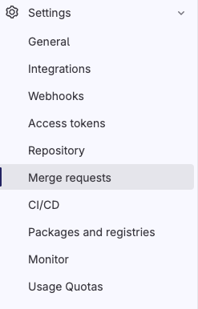
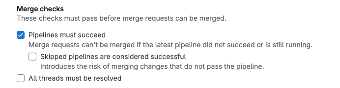

## CI/CD Security: Using Checkov to Enforce Best Practices


[This tutorial on my blog](https://igorzhivilo.com/2025/02/13/checkov-ci/)

In this tutorial, I will guide you through the following:
* Integrating Checkov into your GitLab pipeline to enforce security best practices.
* Enabling specific individual security checks.
* Configuring enforcement to fail the pipeline on failed checks.
* My recommended initial policy set for getting started.
* Sharing my experiences and insights on common issues I’ve encountered.

### 🚀 Why Use Checkov?

* Prevents security misconfigurations early
* Automates compliance enforcement
* Integrates seamlessly into DevOps pipelines
* Covers multiple IaC frameworks
* Open-source and actively maintained

### Why I Use Checkov

#### Reason 1: Enforce Security
We use Terraform as our Infrastructure as Code (IaC) solution, and we want to enforce security best practices for any Terraform code merged into our repository. Checkov helps us achieve this by providing automated security and compliance checks.

For example, I want to ensure that:
* Every S3 bucket added via Terraform is encrypted to protect sensitive data.
* Every S3 bucket is not publicly accessible to prevent unintended exposure.

By integrating Checkov into our GitLab pipeline, we can automatically scan our Terraform code and enforce these security policies before changes are merged.

#### Reason 2: Compliance
To achieve SOC 2 compliance, your Terraform code must be covered by automated tests. Otherwise, you would need to manually verify and document that each merged commit was tested in a QA environment, which is time-consuming, burdensome, and prone to errors. Automated security testing simplifies this process, ensuring compliance with minimal effort.

## Let's do it!

### Integrate checkov to your pipeline and enabling specific individual security checks.


```yaml
stages:
  - test

static-test:
  stage: test
  allow_failure: true
  image:
    name: bridgecrew/checkov:latest
    entrypoint:
      - '/usr/bin/env'
      - 'PATH=/usr/local/sbin:/usr/local/bin:/usr/sbin:/usr/bin:/sbin:/bin'
  before_script:
    - pip install checkov
  script:
    - checkov -d terraform --check CKV_AWS_19,CKV_AWS_20 | tee checkov.test.xml
  artifacts:
    reports:
      junit: "checkov.test.xml"
    paths:
      - "checkov.test.xml"
```


#### Explanation

* A test stage will be added as part of the pipeline.
* the bridgecrew/checkov:latest Docker image will be used, as it comes with Checkov pre-installed. If you prefer not to use this image, you can manually install Checkov using pip:
```yaml
before_script:
    - pip install checkov
```
* All TF code located in terraform directory
* A JUnit report will be generated and attached to each pipeline run for better visibility of the test results.
* In my example, I used two security policies related to S3 bucket security: CKV_AWS_19 and CKV_AWS_20 (--check flag means, allow only the two specified checks to run ).
	• CKV_AWS_19: Ensures that server-side encryption is enabled for the S3 bucket.
	• CKV_AWS_20: Ensures that the S3 bucket is not publicly accessible.

This serves as a great starting point, and you can gradually expand by adding more security policies over time.


### Configuring enforcement to fail the pipeline on failed checks.

1. Go to: Setting ->  'merge requests'


2. Enable 'Pipelines must succeed' checkbox and click save
