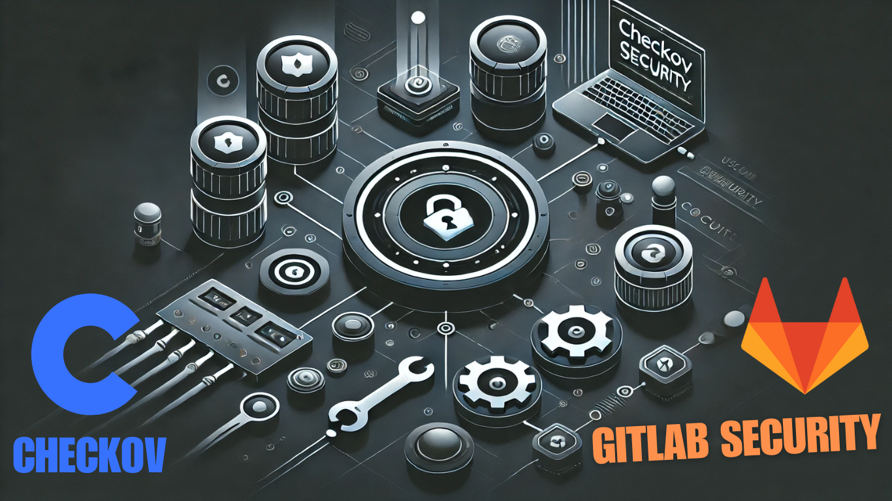

## CI/CD Security: Using Checkov to enforce security with terraform



[This tutorial on my blog](https://igorzhivilo.com/2025/02/13/checkov-ci/)

The purpose of this tutorial is to provide a solid starting point for enforcing security best practices in your Terraform scripts.

I will walk you through the following steps:
* Integrating Checkov into your gitlab pipeline.
* Enabling specific individual security checks.
* Configuring enforcement to fail the pipeline on failed checks.
* Gradually expanding policy recommendations.

### 🚀 Why Use Checkov?

* Prevents security misconfigurations early
* Automates compliance enforcement
* Integrates seamlessly into DevOps pipelines
* Covers multiple IaC frameworks
* Open-source and actively maintained

### Why I Use Checkov

#### Reason 1: Enforce Security
We use Terraform as our Infrastructure as Code (IaC) solution, and we want to enforce security best practices for any Terraform code merged into our repository. Checkov helps us achieve this by providing automated security and compliance checks.

For example, I want to ensure that:
* Every S3 bucket added via Terraform is encrypted to protect sensitive data.
* Every S3 bucket is not publicly accessible to prevent unintended exposure.

By integrating Checkov into our GitLab pipeline, we can automatically scan our Terraform code and enforce these security policies before changes are merged.

#### Reason 2: Compliance
To achieve SOC 2 compliance, your Terraform code must be covered by automated tests. Otherwise, you would need to manually verify and document that each merged commit was tested in a QA environment, which is time-consuming, burdensome, and prone to errors. Automated security testing simplifies this process, ensuring compliance with minimal effort.

## Let's do it!

### Integrate checkov to your pipeline and enabling specific individual security checks.


```yaml
stages:
  - test

static-test:
  stage: test
  allow_failure: true
  image:
    name: bridgecrew/checkov:latest
    entrypoint:
      - '/usr/bin/env'
      - 'PATH=/usr/local/sbin:/usr/local/bin:/usr/sbin:/usr/bin:/sbin:/bin'
  script:
    - checkov -d terraform --check CKV_AWS_19,CKV_AWS_20 | tee checkov.test.xml
  artifacts:
    reports:
      junit: "checkov.test.xml"
    paths:
      - "checkov.test.xml"
```


#### Explanation

* A test stage will be added as part of the pipeline.
* the bridgecrew/checkov:latest Docker image will be used, as it comes with Checkov pre-installed. If you prefer not to use this image, you can manually install Checkov using pip:
```yaml
before_script:
  - pip install checkov
```
* All TF code located in terraform directory
* A JUnit report will be generated and attached to each pipeline run for better visibility of the test results.
* In my example, I used two security policies related to S3 bucket security: CKV_AWS_19 and CKV_AWS_20 (--check flag means, allow only the two specified checks to run ).

    * CKV_AWS_19: Ensures that server-side encryption is enabled for the S3 bucket.

    * CKV_AWS_20: Ensures that the S3 bucket is not publicly accessible.

This serves as a great starting point, and you can gradually expand by adding more security policies over time.


### Configuring enforcement to fail the pipeline on failed checks.

1. Go to: Setting -> 'merge requests'


2. Enable 'Pipelines must succeed' checkbox and click save


### Gradually Expanding Policy Recommendations

> Note: Since we primarily work with AWS, we will focus on AWS-specific policies.

1️⃣ Choose an Initial Resource
	  *	Start with a single resource, such as an S3 bucket (as in this example).

2️⃣ Apply a Minimal Set of Security Policies
	  *	Begin with essential security checks for S3:
	  *	CKV_AWS_19: Ensures that server-side encryption is enabled for the S3 bucket.
	  *	CKV_AWS_20: Ensures that the S3 bucket is not publicly accessible.

3️⃣ Align with Existing Terraform Code & Fix Issues
	  *	Review current Terraform configurations and remediate any violations based on policy findings.

4️⃣ Incrementally Add More Policies Over Time
	  *	Introduce additional policies every quarter, ensuring a gradual and manageable improvement.

📌 Each iteration should expand coverage—start with S3, refine policies, and then extend to other AWS resources as needed. 🚀

> Another useful option is to utilize a baseline that ignores already known issues, allowing you to focus on new ones. To achieve this, you can create a baseline using the --create-baseline option and then apply it during each scan with the --baseline BASELINE option.

#### Usinfg checkov config file

You can use a configuration file with Checkov, which can be especially helpful if you have a long list of security checks to manage.

```bash
checkov --config-file path/to/config.yaml
```

config.yaml
```yaml
check:
  - CKV_AWS_19
  - CKV_AWS_20
directory:
  - terraform
```

### Suppressing and skipping policies inside code
[checkov.io docs](https://www.checkov.io/2.Basics/Suppressing%20and%20Skipping%20Policies.html#:~:text=Suppressing%2Fskipping,-Like%20any%20static&text=For%20example%2C%20if%20a%20resource,run%20or%20skip%20certain%20checks)

#### Example
> The following comment skips the CKV_AWS_20 check on the resource identified by foo-bucket, where the scan checks if an AWS S3 bucket is private. In the example, the bucket is configured with a public read access; Adding the suppression comment skips the appropriate check instead of the check failing.

```terraform
resource "aws_s3_bucket" "foo-bucket" {
  region        = var.region
    #checkov:skip=CKV_AWS_20:The bucket is a public static content host
  bucket        = local.bucket_name
  force_destroy = true
  acl           = "public-read"
}
```

### AWS Policies to Gradually Incorporate into Your Pipeline with terraform
[list of all policies](https://www.checkov.io/5.Policy%20Index/all.html)

1. S3 Bucket Security:
  *	CKV_AWS_19: Ensures that server-side encryption is enabled for the S3 bucket.
  *	CKV_AWS_20: Ensures that the S3 bucket is not publicly accessible.

2. Security Groups:
  *	CKV_AWS_25: Ensure no security groups allow ingress from 0.0.0.0:0 to port 3389	
  *	CKV_AWS_24: Ensures no security groups allow ingress from 0.0.0.0/0 to port 22.

3. EC2 Instances:
  *	CKV_AWS_8: Ensures all data stored in the EBS is securely encrypted at rest.

4. RDS Instances:
  *	CKV_AWS_17: Ensures all data stored in the RDS is securely encrypted at rest.
  *	CKV_AWS_18: Ensures RDS instances are not publicly accessible.

5. Amazon Elastic Block Store (EBS):
	*	CKV_AWS_3: Ensures that EBS volumes are encrypted.
	*	CKV_AWS_144: Ensures that EBS volumes have snapshots enabled for backup purposes.

6. Amazon Elastic Kubernetes Service (EKS):
	*	CKV_AWS_39: Ensures that EKS clusters are not publicly accessible.

7. AWS Lambda:
	*	CKV_AWS_116: Ensures that Lambda functions have environment variables encrypted.

8. IAM security:
  * CKV_AWS_1: Ensures IAM policies that allow full administrative privileges are not created.
  * CKV_AWS_49: Ensures no IAM policy documents allow “*” as a statement’s actions.
  * CKV_AWS_110: Ensures IAM policies do not allow privilege escalation.


Thank you for reading, I hope you enjoyed it, see you in the next post.

Please subscribe to my [YT channel](https://www.youtube.com/@igorzhivilo) and [twitter](https://twitter.com/warolv), to be notified when the next tutorial is published.

You can find it also in my [blog](https://igorzhivilo.com)

