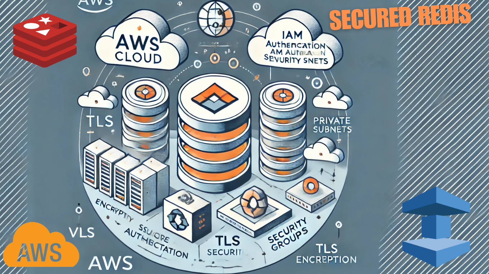

## Provision a Secure AWS ElastiCache Redis Instance Using Terraform



[This tutorial on my blog](https://igorzhivilo.com/2025/02/23/secured-redis/)

The goal of this tutorial is to deploy AWS ElastiCache Redis with an emphasis on security best practices.

I will guide you through the following Redis security features:

* Encryption at rest and in transit
* Network access restrictions
* IAM integration and authentication for access control
* Creation of three default users for authorization
* Terraform script example for deploying Redis
* Python script example for interacting with Redis

> Topics such as single-node vs. cluster deployment and high availability will be excluded from this tutorial.


#### Why managed service like ElastiCache and not self managed redis?

* AWS automatically handles security patches, encryption, and monitoring.
* Provides IAM-based access control and automated backups.
* Supports VPC & Security Groups for network isolation.

#### Explore Redis security features

AWS ElastiCache for Redis provides **two key types of encryption** to enhance security:

##### 1. Encryption at Rest
* Protects data stored on disk (backups, snapshots, and swap files).
* Uses AES-256 encryption.
* Automatically encrypts data when stored in AWS.
* Enabled via: at_rest_encryption_enabled = true

##### 2. Encryption in Transit
* Secures data moving between clients and Redis.
* Uses TLS (Transport Layer Security) v1.2 or later.
* Ensures end-to-end encryption between applications and Redis.
* Requires clients to use TLS-supported Redis drivers.
* Enabled via: transit_encryption_enabled = true

#### Terraform Example to Enable Encryption

```hcl
resource "aws_elasticache_replication_group" "redis" {
  replication_group_id          = "secured-redis"
  replication_group_description = "Secure Redis Replication Group"
  node_type                     = "cache.t3.micro"
  num_cache_clusters            = 2
  automatic_failover_enabled    = true
  multi_az_enabled              = true
  engine_version                = "7.0"
  port                          = 6379
  security_group_ids            = [aws_security_group.redis_sg.id]
  subnet_group_name             = aws_elasticache_subnet_group.redis_subnet_group.name

  # Enable Security Features
  transit_encryption_enabled    = true  # Encryption in transit
  at_rest_encryption_enabled    = true  # Encryption at rest
  auth_token                    = "YourSecureAuthToken" # Replace with a strong secret

  tags = {
    Name = "Secured Redis Cluster"
  }
}
```

**aws_elasticache_replication_group** is a Terraform resource used to provision and manage an Amazon ElastiCache Redis cluster in AWS.

This resource helps you:
* Deploy a highly available Redis cluster in AWS.
* Enable automatic failover between primary and replica nodes.
* Configure Redis settings, such as encryption, parameter groups, and backups."

##### Important Notes
* **TLS Connection Required**: If transit encryption is enabled, clients must support **TLS connections**.
* **Token Storage**: Never hardcode auth_token; instead, store it in **AWS Secrets Manager**.
* **Performance Impact**: Enabling encryption may introduce slight latency but significantly improves security.

#####  3. Restrict Network Access

✅ Deploy Redis inside a Private VPC Subnet
* Never expose Redis to the internet (0.0.0.0/0 in security groups is a major risk!).
* Use private subnets with AWS Security Groups to allow access only from trusted applications.

✅ Use AWS Security Groups & NACLs
* Restrict Redis access to only specific IPs or security groups (e.g., only your EC2 instances, Lambda, or Kubernetes workloads).
* Example Security Group Rule:
  * Allow only internal application servers to access Redis (tcp:6379).
  * Block all public IPs (0.0.0.0/0).

✅ Use AWS Network Firewall & WAF
* Prevent malicious traffic with AWS WAF and AWS Shield (DDoS protection).


##### 4. Use IAM & Authentication for Access Control

✅ Enable IAM Authentication (ElastiCache for Redis Only)
* Use AWS IAM authentication tokens to restrict access to trusted AWS services.
* Disable anonymous access to prevent unauthorized connections.

✅ Use Redis AUTH for Password Protection
* Set a strong password using requirepass in redis.conf.
* Example:

requirepass "StrongRandomPassword123!"

* For ElastiCache: Enable AUTH authentication to require a password.

✅ Limit Redis Commands with ACLs (Role-Based Access Control)

* Create custom user roles to limit which commands can be run.
* Example: Block FLUSHALL, CONFIG SET, and SHUTDOWN to prevent accidental data loss:

ACL SETUSER limited_user -@all +get +set +keys +info on >password123

#### Example Terraform script for creating an ElastiCache Redis instance in AWS
```hcl
provider "aws" {
  region = "us-east-1" # Change as per your requirement
}

# VPC Setup
resource "aws_vpc" "main" {
  cidr_block = "10.0.0.0/16"

  tags = {
    Name = "main-vpc"
  }
}

# Private Subnet
resource "aws_subnet" "private_subnet_a" {
  vpc_id            = aws_vpc.main.id
  cidr_block        = "10.0.1.0/24"
  availability_zone = "us-east-1a"

  tags = {
    Name = "private-subnet-a"
  }
}

resource "aws_subnet" "private_subnet_b" {
  vpc_id            = aws_vpc.main.id
  cidr_block        = "10.0.2.0/24"
  availability_zone = "us-east-1b"

  tags = {
    Name = "private-subnet-b"
  }
}

# Security Group for Redis
resource "aws_security_group" "redis_sg" {
  vpc_id = aws_vpc.main.id

  ingress {
    from_port   = 6379
    to_port     = 6379
    protocol    = "tcp"
    cidr_blocks = ["10.0.0.0/16"] # Allow only internal VPC access
  }

  egress {
    from_port   = 0
    to_port     = 0
    protocol    = "-1"
    cidr_blocks = ["0.0.0.0/0"]
  }

  tags = {
    Name = "redis-security-group"
  }
}

# ElastiCache Subnet Group
resource "aws_elasticache_subnet_group" "redis_subnet_group" {
  name       = "redis-subnet-group"
  subnet_ids = [aws_subnet.private_subnet_a.id, aws_subnet.private_subnet_b.id]

  tags = {
    Name = "Redis Subnet Group"
  }
}

# ElastiCache Redis Cluster
resource "aws_elasticache_replication_group" "redis" {
  replication_group_id       = "secured-redis"
  replication_group_description = "Secure Redis Replication Group"
  node_type                  = "cache.t3.micro" # Change as per needs
  num_cache_clusters         = 2
  automatic_failover_enabled = true
  multi_az_enabled           = true
  engine_version             = "7.0"
  parameter_group_name       = "default.redis7"
  port                       = 6379
  security_group_ids         = [aws_security_group.redis_sg.id]
  subnet_group_name          = aws_elasticache_subnet_group.redis_subnet_group.name

  # Security Features
  transit_encryption_enabled     = true  # Encryption in transit
  at_rest_encryption_enabled      = true  # Encryption at rest
  auth_token                      = "YourSecureAuthToken" # Replace with a strong token

  tags = {
    Name = "Secured Redis Cluster"
  }
}

output "redis_primary_endpoint" {
  value = aws_elasticache_replication_group.redis.primary_endpoint_address
}
```

##### Why Should You Enable Encryption at Rest and In Transit When Creating an ElastiCache Instance?

In AWS ElastiCache, encryption settings (both at rest and in transit) cannot be changed after the instance is created. If you later decide to enable encryption, you would need to recreate the entire instance, which can lead to downtime, data loss, and operational complexity.

#### Example of python script to use TLS (Encryption in transit)
Here’s a **Python example** to securely connect to **AWS ElastiCache Redis** using **TLS encryption** and **authentication token**.

##### Prerequisites

1. Install redis-py library:

```bash
  pip install redis
```

2. Ensure your ElastiCache Redis instance has:
	* Encryption in Transit enabled (transit_encryption_enabled = true).
	* Authentication token enabled (auth_token is set).

```python
import redis
import ssl

# Replace with your actual ElastiCache Redis endpoint
REDIS_ENDPOINT = "your-redis-endpoint.cache.amazonaws.com"
REDIS_PORT = 6379  # Default Redis port
AUTH_TOKEN = "YourSecureAuthToken"  # Store securely (e.g., AWS Secrets Manager)

# Establish a secure connection with TLS
redis_client = redis.StrictRedis(
    host=REDIS_ENDPOINT,
    port=REDIS_PORT,
    password=AUTH_TOKEN,
    ssl=True,  # Enable TLS
    ssl_cert_reqs=ssl.CERT_NONE  # Change to CERT_REQUIRED for stricter verification
)

# Test connection
try:
    redis_client.ping()
    print("✅ Secure connection to Redis established successfully!")
except redis.ConnectionError as e:
    print(f"❌ Connection failed: {e}")

# Example Redis operations
redis_client.set("secure_key", "Hello, Secure Redis!")
value = redis_client.get("secure_key")

print(f"🔐 Retrieved Value: {value.decode('utf-8')}")  # Decoding from bytes to string
```

##### Explanation

* TLS Encryption (ssl=True): Ensures data is encrypted in transit.
* Authentication Token (password=AUTH_TOKEN): Required for connecting securely.
* Strict Redis Connection ssl_cert_reqs=ssl.CERT_NONE):
* Use ssl.CERT_REQUIRED for stricter verification with CA certificates.
* Ping Test redis_client.ping()): Confirms a successful connection.

#### Terraform Script to Create 3 Default Users for ElastiCache Redis

This Terraform script provisions an **ElastiCache Redis** instance with three default users:
1. **Admin** – Full access
2. **Read-Only** – Can read but not write
3. **Service User** – Intended for application services with limited permissions

##### 🔹 Terraform Script

```hcl
# ElastiCache User Group
resource "aws_elasticache_user_group" "redis_users" {
  engine   = "redis"
  user_group_id = "redis-user-group"

  user_ids = [
    aws_elasticache_user.admin.user_id,
    aws_elasticache_user.readonly.user_id,
    aws_elasticache_user.service.user_id
  ]
}

resource "aws_elasticache_user" "admin" {
  user_id       = "admin-user"
  user_name     = "admin"
  engine        = "redis"
  passwords     = [random_string.admin_token.result]
  access_string = "on ~* +@all" # Full access
  no_password_required = false
}

resource "aws_elasticache_user" "readonly" {
  user_id       = "readonly-user"
  user_name     = "readonly"
  engine        = "redis"
  passwords     = [random_string.readonly_token.result]
  access_string = "on ~* +@read" # Read-only access
  no_password_required = false
}

resource "aws_elasticache_user" "service" {
  user_id       = "service-user"
  user_name     = "service"
  engine        = "redis"
  passwords     = [random_string.service_token.result]
  access_string = "on ~* +@read +@write" # Read and write access
  no_password_required = false
}
```

##### 🔹 Explanation

* Three users with different roles:
  * Admin (+@all)
  * Read-Only (+@read)
  * Service (+@read +@write)
* Passwords stored securely in AWS Secrets Manager.
* Users attached to a User Group (redis-user-group).
* User Group linked to ElastiCache Redis Cluster.


Thank you for reading, I hope you enjoyed it, see you in the next post.

Please subscribe to my [YT channel](https://www.youtube.com/@igorzhivilo) and [twitter](https://twitter.com/warolv), to be notified when the next tutorial is published.

You can find it also in my [blog](https://igorzhivilo.com/2025/02/23/secured-redis/)
